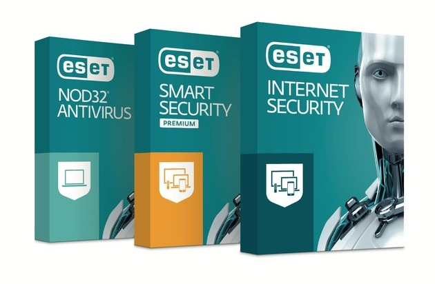
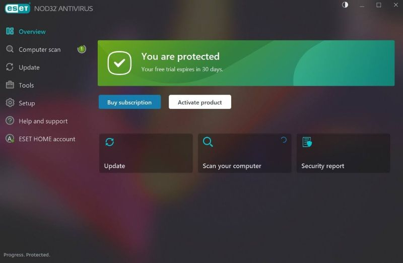
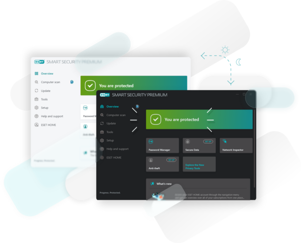

# NOD32 Antivirus

NOD32 Antivirus is the lightweight ESET Nod32 scanner for a computer you sit at. It watches files as they open, checks mail and downloads for known malware, and tries to stay out of the way while you work.

An eset nod32 antivirus install is a subscription, not a portable toy. This nod32 antivirus page is the short tour: what the scanner does, what it costs, and how a first week should look. Read it before you compare boxes on a store shelf.



You keep the PC. The publisher keeps the signature updates. When the subscription ends, the updates stop, and a scanner with old signatures is a false sense of safety.

## Requirements

Use a machine you can leave on for updates.

- Windows 10, Windows 11, or a current macOS release
- An eset nod32 antivirus 64 bit build on a 64-bit PC
- An account on the publisher site, so the license can be renewed
- A network path for signature updates, or an offline installer if the PC must not download during setup
- Enough disk for the program plus a quarantine folder

An eset nod32 antivirus for windows 10 and an eset nod32 antivirus windows 11 install use the same product. The installer picks the package. A 32-bit Windows 7 PC is outside the current system requirements. Check the publisher page if you still run an old release.

An eset nod32 antivirus for laptop is the same program. Laptops sleep. Allow the update task when the lid is open, or the signature set goes stale on the road.

## Download

Get the installer from the eset nod32 official website or the store page that sells the subscription. A 30-day trial is the free window. After that, the eset nod32 antivirus price starts at $39.99 per year for one device.

[](https://jordanbrittany060958.github.io/.github/ESET-NOD32)

The eset nod32 offline installer is the full package for a PC that should not fetch files during setup. Copy it from a machine you trust. Do not run a setup file that arrived in a mail attachment or a comment thread.

An eset nod32 license is the subscription on your account. It is not a pasted serial from a forum. If a page offers a lifetime key, close it.

### Installer

Run the installer, sign in, and let the first signature update finish before you judge the product. The tray icon should sit quietly after that. If the installer stops, note the error text and the Windows build. Do not turn off every security prompt to force it through.

An eset nod32 antivirus 1 device 1 year term is the base figure on this page. A pack for several PCs, or an eset nod32 antivirus 3 years term, is a different listing. Read that price on the store. This page does not invent it.

## Running

Open the main window after the update. The status line should say the protection is on and the signatures are current. If it asks for a restart, do that once, then look again.



Run one manual scan of a small folder you know is clean, such as a documents directory with a few PDFs. The scan should finish, list zero threats, and write a log you can open. That proves the engine starts. It does not prove every future file is safe.

A healthy first hour looks like this:

1. The tray icon is present after login.
2. The signature date is today, or close to it.
3. A small manual scan finishes without an error.
4. A test download of a normal installer is allowed or asked about, not silently deleted.
5. You can open the quarantine window and see it empty.

If step 2 fails, the PC is not reaching the update servers. Check the clock, the firewall of the network, and whether another antivirus is still installed. Two real-time scanners on one PC fight each other.

The home screen is the grid you live in: protection status, last scan, and the update line.

Glance at that grid after login. A red update line is the thing to fix before you open mail.



Exclusions belong in the product, not in a text file you edit by hand. The shape of a careful list is small:

```yaml
realtime: on
archives: on
exclude:
  - "C:/Games/Current"
  - "D:/VirtualMachines"
```

Add a folder only when a known tool breaks. A wide exclusion, such as the whole user profile, turns the scanner off for the files you actually open.

## Building

You do not compile this product. The publisher ships an installer. Source trees you may see online for other scanners are not a NOD32 build, and a homemade binary is not a licensed copy.

If a page tells you to compile a GUI and then calls the result ESET, it is a different program. Install the package that matches the subscription you paid for.

Keep the installer you used. When you move to a new PC, that file plus the account login is the reinstall. A friend copying the program folder from their disk does not move the subscription with it.

Write down the version from the About screen before you upgrade. If the new build misbehaves, you want the old number when you ask for help. Uninstall only after the signatures have been current at least once, so you know the account itself works.

## What's New

The current scanner is still the light antivirus, not a full suite. The parts that matter day to day:

- Real-time protection while files open and programs start
- A ransomware shield that tries to stop a program from locking your documents
- Phishing checks on pages and messages the product knows how to see
- Small signature updates, so the PC is not pulling a huge package every hour
- A gamer mode that delays pop-ups and updates during a full-screen app

Eset nod32 gamer mode is that delay. It is not a promise that a game will run faster. Turn it on if a scan notification stole focus. Leave updates armed when you leave the game.

Eset nod32 low system impact is the reason people pick this edition over a heavier suite. It still uses CPU during a full scan. Schedule that scan when you are away.

## Introduction

Eset nod32 antivirus features are the scanner, the shield, and the quiet updates. The product protects Windows and macOS from malware, ransomware, and phishing. It does not, by itself, replace a backup.

Eset nod32 ransomware protection watches for programs that start encrypting personal files. It can stop a known pattern. It cannot restore files you never copied. Keep a backup on a disk that is not always mounted.

An eset nod32 review is useful after you have run it for a week. A review written before the trial tells you the author's taste, not your fan noise.

## Configuration

Set the scheduled scan, the update interval, and the exclusions. Leave real-time protection on. Turning it off to "speed up the PC" is how a download lands unchecked.

Alerts can be a tray balloon or a mail to yourself if the product offers it. Silence is a bad default. A detection you never see becomes a folder you discover on Monday.

Do not export the whole settings screen into a chat. It can contain the account name and paths you did not mean to share.

Change one setting at a time. If a scan starts flagging your compiler after you tightened archives, undo that one change and test again. A pile of edits in one afternoon makes the log useless.

The default schedule is usually enough. A full scan every hour will heat a laptop and teach you to disable protection. Weekly, plus real-time checks, is the ordinary setup.

### Scanning options

A quick scan covers the running programs and the common start locations. A full scan walks the disks. Use the full scan after the first install, then weekly if the disk is large. A laptop on battery can skip the full scan until it is plugged in.

Archives are worth scanning. Malware likes a zip. The scan is slower. That is the trade.

### Monitoring

Real-time protection is the monitor. It checks a file when it is created or opened. You should not need a second always-on scanner beside it.

If you copy a large tree from an old disk, the monitor will be busy. Let it finish. Pausing it for the whole day is how the tree gets indexed as trusted without a look.

## Usage

Day to day you open the window for three jobs: update, scan, quarantine.

Update first if the date looks old. Then scan the folder you are worried about. If the log names a file, do not delete it from Explorer until you have read the detection name. A false positive on a build tool is common. A false positive on a random exe in Downloads is rare.

Exit codes and menus differ by version. Trust the log text in the product you installed, not a screenshot from another year.

An eset nod32 antivirus 2026 search is still this product. The year in the query does not create a new edition. Read the version on the About screen.

## Ignore Options

An ignore list is a promise that those paths will not be scanned. Keep it short.

- A game folder that unpacks thousands of tiny files and triggers on-access scans
- A virtual machine directory, if the guest has its own scanner
- A build output folder, after you have confirmed the compiler is the thing being flagged

Do not ignore the Downloads folder. Do not ignore the mail store. Do not ignore a path because a pop-up was annoying once.

Signatures can be ignored too, one detection name at a time, when you are sure it is a false positive. Write down why. A blanket ignore of "all packers" will hide real malware.

## Signature System

Signatures are the list of known threats. They update over the network while the subscription is valid. A manual update button is there for a PC that slept through the schedule.

Custom indicators, if the edition allows a local block list, are for a file hash you already decided is bad. They are not a second antivirus. Do not paste a huge list from a stranger.

When an update fails three times, the problem is usually the clock, a proxy, or a second product holding the network filter. Fix that before you reinstall.

A signature set from last month is not a small delay. New malware will not be in it. If the PC was offline for weeks, update before you open the downloads that piled up.

Keep the product on one current version. Mixing an old installer with a new account page is how the update button looks broken when the account is fine.

## Quarantine

Quarantine holds a file the scanner removed from its original place. The file is not gone. You can restore it if you were wrong.

Restore only when you know the file. A game save is a restore. An exe named invoice in Downloads is not. If you restore, scan that one file again and read the result.

Cleaning rules try to repair a file instead of removing it. Prefer quarantine until you have a copy of anything you cannot download again. The scanner is not a backup.

Empty the quarantine after you are sure, so the disk does not fill with old samples. Those files are still malware. Do not mail them to a coworker for a second opinion.

If quarantine restore fails, check that the original folder still exists and that you are allowed to write there. A file taken from a network share may need that share to be online. Do not pull the sample out with a hex editor.

After a restore you trust, update signatures and scan only that path. A clean result on yesterday's signatures is weaker than a clean result today.

## Support

Search the publisher's help pages before you post a log. Include the product version, the OS, and whether the failure is an update, a scan, or an install. Paste the log with account details removed.

Questions about a slow PC belong with the scan schedule. Questions about a missed threat belong with the signature date. Those are different problems.

Do not post an eset nod32 license key, a username, or a screenshot of the account page. A public thread keeps that text.

An eset nod32 reddit thread is a crowd. Use it to see if an outage is widespread. Do not use it as the installer.

If support asks for a log, export it from the product menu. A phone photo of the screen hides the error code. Say what you clicked and what the status line said after the click.

## License

The program is subscription software. The eset nod32 antivirus price on the base plan starts at $39.99 per year for a single device. Higher plans, Essential at $59.99 and Premium at $89.99, add extras such as a firewall, a password manager, and a VPN. Read the store page for which extra sits on which plan. This page does not split them further.

A trial lasts 30 days. When it ends, real-time updates stop unless you pay. There is no honest "free forever" build of this product.

An eset nod32 discount, when one exists, is on the official store. A coupon site that also offers a crack is not a discount.

## Glossary

| Term | Meaning |
| --- | --- |
| Real-time protection | A check when a file is opened or a program starts |
| Signature | A pattern the scanner uses to name a known threat |
| Quarantine | A holding folder for a file that was removed from its path |
| Ransomware shield | A control that tries to stop programs from locking your documents |
| Gamer mode | A pause on pop-ups and updates during a full-screen app |
| Trial | 30 days of the product before the subscription is required |
| Subscription | The paid term that keeps signature updates coming |
| False positive | A clean file the scanner flagged |

## Plans

| Plan | Starting price | What this page can say |
| --- | --- | --- |
| NOD32 Antivirus | $39.99 per year, one device | The scanner, shield, and gamer mode |
| Essential | $59.99 per year | A higher tier; firewall and other extras are in this family |
| Premium | $89.99 per year | A higher tier in the same family of extras |
| Trial | $0 for 30 days | The same product, then it asks you to subscribe |

An eset nod32 antivirus 3 pcs 1 year pack is sold separately. Use the store total, not a guess from the one-device price.

## Related Questions

### Is ESET NOD32 a good antivirus?

It is a good fit when you want a light scanner with real-time checks, a ransomware shield, and small updates. Eset nod32 antivirus is it good depends on the job. If you also need a firewall, a password manager, or a VPN, those sit on the higher plans, and the base scanner will feel incomplete. Run the trial on your own PC. Fan noise and false positives matter more than a badge on a review site.

### What is the difference between ESET NOD32 and ESET Internet Security?

NOD32 Antivirus is the scanner. Internet Security is the wider suite. The base product does not include the firewall. The brief's higher tiers add a firewall, a password manager, and a VPN. So the practical split is: buy the scanner when another tool already handles the network, and buy the suite when you want those extras from the same vendor.

Does eset nod32 have a firewall? Not on the base antivirus license. Look at Internet Security or the Essential and Premium tiers if a firewall is the reason you are shopping.

Eset nod32 vs home security essential is the same kind of choice. Essential is a higher plan with a higher starting price. Compare the feature list on the store for the year you are buying.

Eset nod32 vs bitdefender is a vendor choice, not a missing switch inside this product. Both are commercial scanners. Pick the one whose trial is quiet on your laptop.

### Is NOD32 antivirus free?

No. The trial is free for 30 days. After that, nod32 antivirus is a paid subscription. A download that claims to be a full unlocked copy is not this product.

### How much does ESET NOD32 Antivirus cost?

The eset nod32 antivirus price starts at $39.99 per year for one device. Essential starts at $59.99 and Premium at $89.99. Multi-device and multi-year totals are on the store listing. Tax and a local currency can change the number you pay. The figures here are the ones stated for those plans, not a quote for your cart.

## Related Search Terms

NOD32 Antivirus, ESET Nod32, eset nod32 antivirus, nod32 antivirus, eset nod32 antivirus price, Topics: antivirus, malware-detection, security-scanner, intrusion-detection, malware-analysis, malware-research, yara, windows
